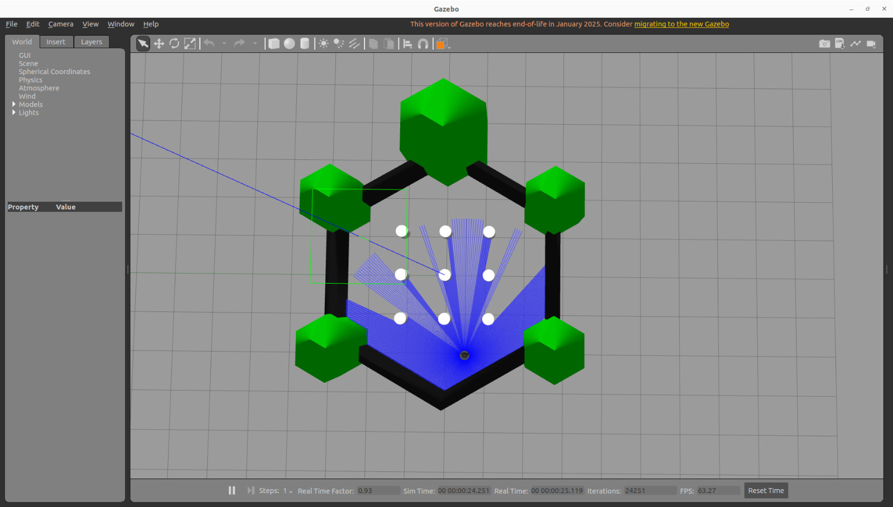
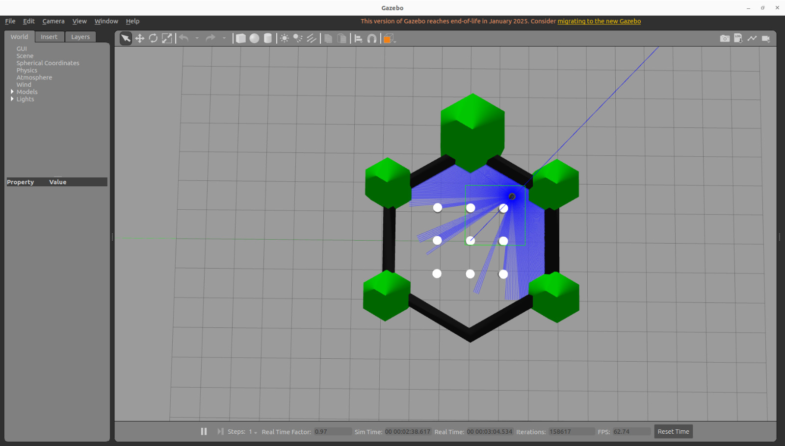
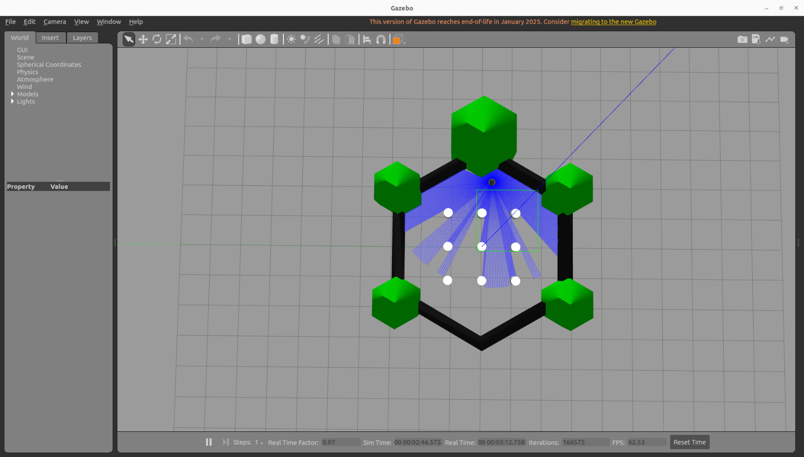
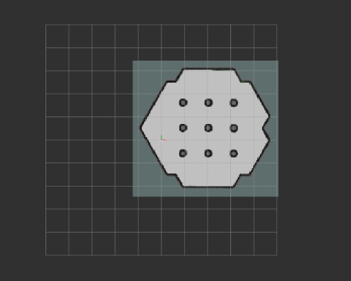
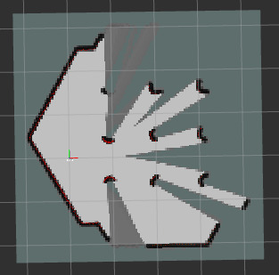
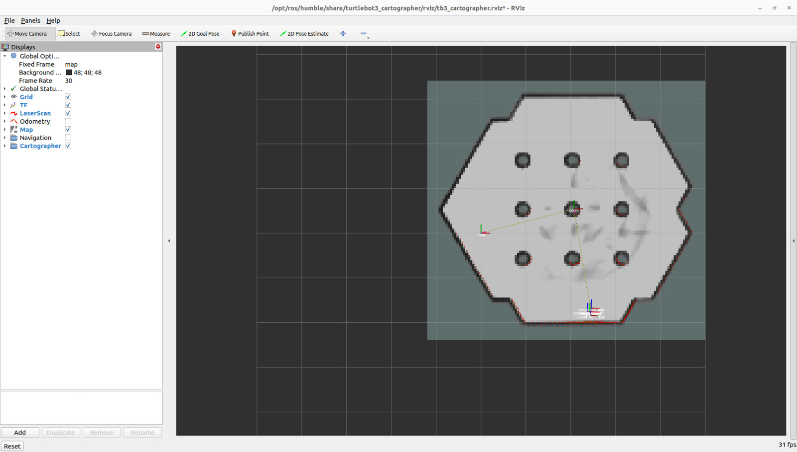
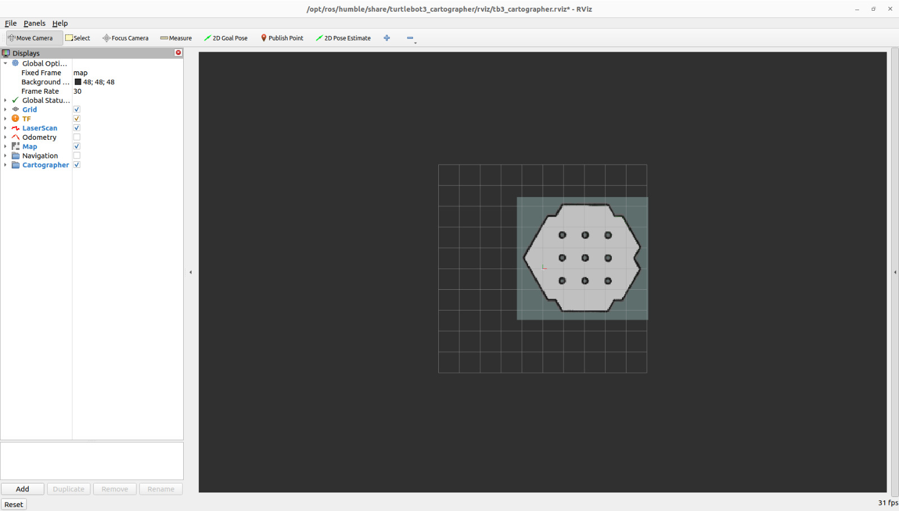
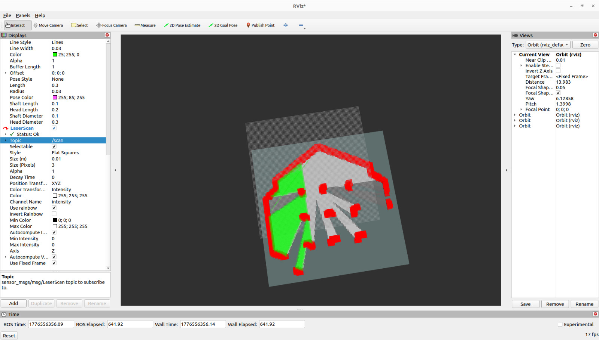

# Adaptive Cell Decomposition Path Planning

## Overview

This project implements an Adaptive Cell Decomposition (ACD) path planning algorithm for autonomous indoor mobile robot navigation using ROS2 Humble and Gazebo. The planner decomposes the environment into adaptive cells to generate efficient, collision-free paths for indoor navigation in simulated environments.

---

## Features

- Adaptive Cell Decomposition Path Planning
- Autonomous Indoor Navigation
- ROS2 Humble Framework
- Gazebo Simulation
- Occupancy Grid Mapping
- Collision-Free Path Generation
- RViz Visualization

---

## Technologies Used

- ROS2 Humble
- Gazebo
- Python
- Nav2
- RViz2
- Ubuntu 22.04

---

## Folder Structure

```text
Adaptive_Cell_Decomposition_Path_Planning/
│
├── images/
├── src/
├── README.md
└── .gitignore
```

---

## Build

```bash
colcon build
source install/setup.bash
```

---

## Run

```bash
ros2 launch acd_planner acd_planner.launch.py
```

---

## Applications

- Autonomous Mobile Robots
- Indoor Robot Navigation
- Warehouse Automation
- Service Robots
- Robotics Research

---

## Project Information

- **Project Duration:** 2026
- **Platform:** ROS2 Humble + Gazebo

---

# Simulation Results

## Gazebo Simulation



---

## Robot Exploration - Stage 1



---

## Robot Exploration - Stage 2



---

## Occupancy Grid Mapping



---

## Mapping Process



---

## Mapping Process



---

## Final Mapping



---

## RViz Occupancy Grid


---

## Path Planning



---

## Adaptive Cell Decomposition


---

## Author

**Kanitha Gabriela Roy M**
